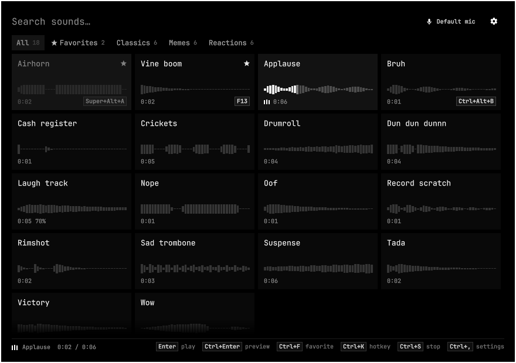
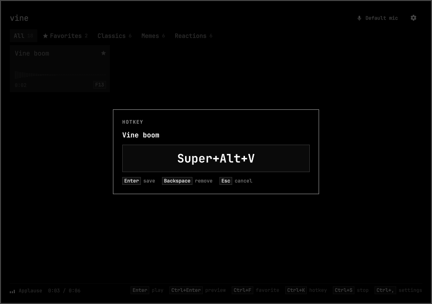
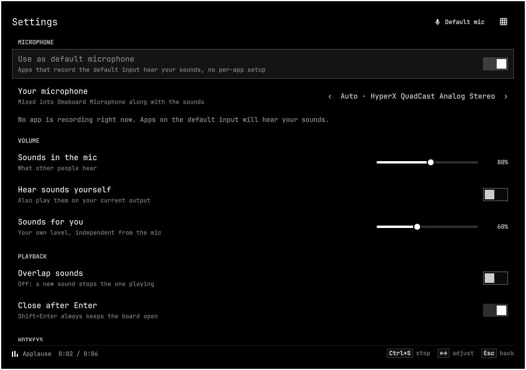

# Omaboard

A soundboard for [Omarchy](https://omarchy.org). Press a key, and a sound plays
into your microphone: whoever is on the other end of the call, stream or game
hears it along with your voice.



It is an Omarchy shell plugin, not a separate app. The board is a keyboard-first
overlay drawn with the shell's own components, so it follows whatever theme you
use, and it costs nothing while you are not using it: no daemon, no web view, no
audio processing running in the background.

- **Plays into your mic.** A virtual "Omaboard Microphone" carries your real
  microphone plus the sounds. By default it becomes your system input, so any app
  set to the default device just works.
- **You hear it too**, on your own output and at your own volume.
- **Global hotkeys** for any sound, bound through Hyprland, plus one to open the
  board and one to stop everything.
- **Folders are the library.** Point it at folders of audio files; subfolders
  become tabs. Coming from Soundux? Your tabs and favorites are imported on first run.
- **Waveforms on every pad**, filling in as the sound plays.
- Plays wav, flac, ogg, opus, mp3 and aiff directly; m4a, aac, webm, wma and
  friends are converted once with ffmpeg and cached.

## Install

Omaboard needs Omarchy 4 (the Quickshell-based shell). Everything else it uses
ships with Omarchy: PipeWire with `pactl`, `pw-play`, `jq` and `ffmpeg`.

```bash
omarchy plugin add https://github.com/<you>/omaboard.git --enable
```

Or from a local checkout:

```bash
ln -s ~/path/to/omaboard ~/.config/omarchy/plugins/omaboard
omarchy-shell shell rescanPlugins
omarchy plugin enable omaboard --before omarchy.audio
```

A bullhorn appears in the bar. Put sounds in `~/Music/Soundboard` (created on
first run) and press <kbd>Super</kbd>+<kbd>Ctrl</kbd>+<kbd>M</kbd>.

## Using the board

Type to search; the board narrows as you type, accents and case ignored.

| Key | Does |
| --- | --- |
| <kbd>Enter</kbd> | Play the selected sound (and close the board) |
| <kbd>Shift</kbd>+<kbd>Enter</kbd> | Play and keep the board open |
| <kbd>Ctrl</kbd>+<kbd>Enter</kbd> | Preview: play only for you, not into the mic |
| <kbd>Alt</kbd>+<kbd>1</kbd>…<kbd>9</kbd> | Play the first nine sounds shown |
| Arrows, <kbd>PgUp</kbd>/<kbd>PgDn</kbd>, <kbd>Home</kbd>/<kbd>End</kbd> | Move around the pads |
| <kbd>Tab</kbd> / <kbd>Shift</kbd>+<kbd>Tab</kbd> | Next / previous tab |
| <kbd>Ctrl</kbd>+<kbd>F</kbd> | Favorite (favorites lead the list and get their own tab) |
| <kbd>Ctrl</kbd>+<kbd>K</kbd> | Set a global hotkey for the sound |
| <kbd>Ctrl</kbd>+<kbd>←</kbd>/<kbd>→</kbd> | Make this sound quieter / louder |
| <kbd>Ctrl</kbd>+<kbd>S</kbd> | Stop everything |
| <kbd>Ctrl</kbd>+<kbd>O</kbd> | Open the sound's folder |
| <kbd>Ctrl</kbd>+<kbd>R</kbd> | Rescan the folders |
| <kbd>Ctrl</kbd>+<kbd>,</kbd> | Settings |
| <kbd>Esc</kbd> | Clear the search, then close |

With the mouse: click a pad to play it, right-click to preview, middle-click (or
the star) to favorite, click the hotkey chip to set one.

The bar button opens the board, right-click stops all sounds, middle-click
toggles hearing them yourself. While something plays, the icon turns into an
equalizer.

### Hotkeys



<kbd>Ctrl</kbd>+<kbd>K</kbd> on a pad, then press the combination. Use
<kbd>Super</kbd>, <kbd>Ctrl</kbd> or <kbd>Alt</kbd> with any key, or F13 and up
on their own, which is what macro keys on most keyboards send. Keys Hyprland
already uses are refused, with what uses them; a key another sound uses moves to
this one. <kbd>Backspace</kbd> removes the hotkey.

Hotkeys follow the physical key, so they keep working when you switch layouts.
Omaboard registers them as Hyprland global shortcuts and keeps the binds in
`~/.local/state/omarchy/toggles/hypr/omaboard.lua`, a folder Omarchy loads on
every Hyprland reload. Your own config files are never touched.

| Default | Does |
| --- | --- |
| <kbd>Super</kbd>+<kbd>Ctrl</kbd>+<kbd>M</kbd> | Open / close the board |
| <kbd>Super</kbd>+<kbd>Ctrl</kbd>+<kbd>Shift</kbd>+<kbd>M</kbd> | Stop all sounds |

Both can be changed or cleared in settings.

### From scripts

The shell exposes Omaboard over IPC:

```bash
omarchy-shell omaboard play "airhorn"      # best match by name, or an exact path
omarchy-shell omaboard preview "airhorn"   # only for you
omarchy-shell omaboard random Memes        # a random sound, optionally from one tab
omarchy-shell omaboard stop
omarchy-shell omaboard toggle
omarchy-shell omaboard status              # JSON: mic, who is listening, what plays
```

## How it works

```
                 ┌────────────────────────────── Omaboard Microphone ─┐
 your mic ──────►│ input.omaboard_mic ──────────────► omaboard_mic   │──► Discord, OBS,
 pw-play sound ─►│ (capture stream)                  (virtual source) │    games, browser
                 └────────────────────────────────────────────────────┘
 pw-play sound ──────────────────────────────────────────────► your headphones
```

The virtual microphone is one `module-remap-source` loaded into pipewire-pulse.
It records your real microphone passively, so the device only opens while some
app records the virtual one, and sounds are played straight into its capture
stream. Each sound is a short-lived `pw-play` per destination; nothing runs
between sounds.

The passthrough follows your default input: pick another mic in Omarchy's audio
panel and Omaboard switches to it. Picking a real mic as the default also turns
off "use as default microphone", and picking Omaboard Microphone turns it back
on; Omaboard never fights you over the default.

Restarting the shell or reloading plugins leaves the virtual microphone alone,
so calls carry on. Disabling or removing the plugin takes it away and restores
your previous default input.

## Settings



<kbd>Ctrl</kbd>+<kbd>,</kbd> in the board covers everything: the default-mic
switch, which microphone passes through, the volume of sounds in the mic and for
you, overlap, hotkeys and folders. Changes save as you go to
`~/.config/omaboard/config.json`, which you can also edit by hand; the shell
picks edits up live.

```jsonc
{
  "folders": [
    { "path": "~/Music/Soundboard", "recursive": true },    // subfolders become tabs
    { "path": "~/Downloads/audios", "name": "Memes" }       // just this folder
  ],
  "mic": "auto",           // or a source name from `pactl list short sources`
  "defaultMic": true,      // make Omaboard Microphone the default input
  "monitor": true,         // hear sounds yourself
  "micVolume": 80,         // % — what others hear
  "monitorVolume": 60,     // % — what you hear
  "overlap": false,        // a new sound stops the one playing
  "closeOnPlay": true,     // Enter closes the board
  "sounds": { "/full/path.mp3": { "favorite": true, "volume": 120, "hotkey": { "keys": "SUPER + ALT + code:10", "label": "Super+Alt+1" } } }
}
```

## Troubleshooting

**People hear me but not the sounds.** The app is probably recording your
microphone directly. Set its input to *Default* (or to *Omaboard Microphone*).
In Discord, also turn off *Noise Suppression* (Krisp): it is built to remove
anything that is not a voice, sounds included.

**They hear the sounds twice, or with an echo.** You are probably on speakers,
and your microphone picks up the copy you hear. Use headphones, or turn off
*Hear sounds yourself*.

**"Mic offline" in the board.** Check the module and the shell's log:

```bash
pactl list short modules | grep omaboard_mic
qs log -p "$OMARCHY_PATH/shell" | grep omaboard
```

**A hotkey does nothing.** `hyprctl globalshortcuts` should list
`omaboard:play-…` for it, and `omarchy menu keybindings --print` the bind.

## Uninstall

```bash
omarchy plugin remove omaboard
```

This removes the hotkeys and the virtual microphone and restores your default
input. Settings stay in `~/.config/omaboard`; delete that folder and
`~/.cache/omaboard` to remove everything.

## Development

```bash
dev/run              # run Omaboard in its own Quickshell instance
dev/run ipc toggle   # open the board there
dev/run key ctrl+k   # simulate a key press on the board
dev/run log          # follow its log
dev/run stop
node --test tests/   # unit tests for the logic in lib/
```

The dev instance opens the board on the monitor you are not using and without
taking the keyboard, and leaves hotkeys off, so it never fights an installed
Omaboard. `OMABOARD_DEV_FOCUS=1` and `OMABOARD_DEV_HOTKEYS=1` turn those back on.

The pieces:

| | |
| --- | --- |
| `Service.qml` | Library, playback, virtual microphone, hotkeys, IPC |
| `Board.qml` | The overlay |
| `BarWidget.qml` | The bar button |
| `components/` | Pads, waveform, settings page, hotkey recorder |
| `lib/` | Pure logic: search, config, hotkey parsing (tested with node) |
| `bin/omaboard-audio` | Creates and manages the virtual microphone |
| `bin/omaboard-scan` | Lists the sound folders, with cached durations |
| `bin/omaboard-peaks` | Computes and caches waveforms |
| `bin/omaboard-decode` | Converts formats pw-play cannot read |

## License

MIT
